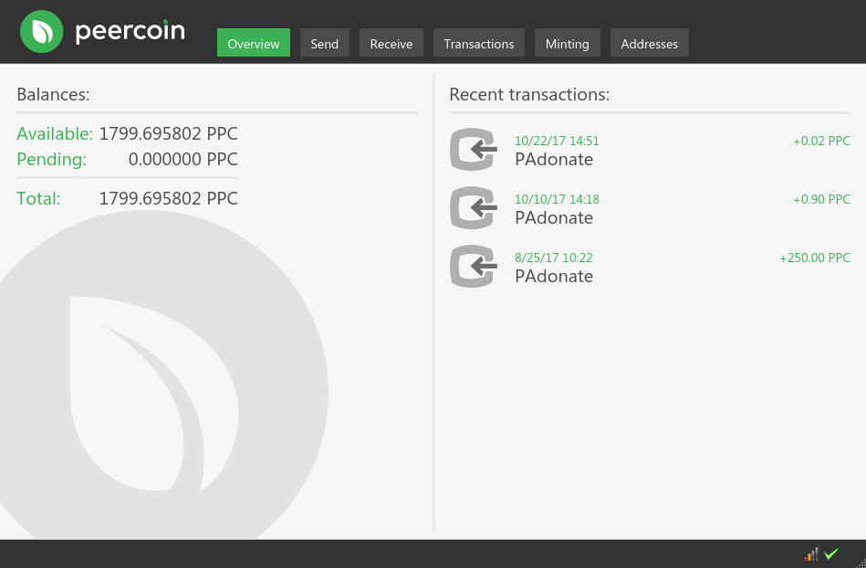
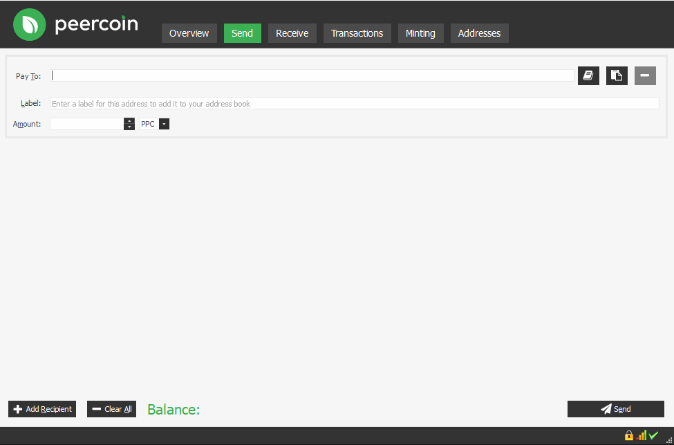
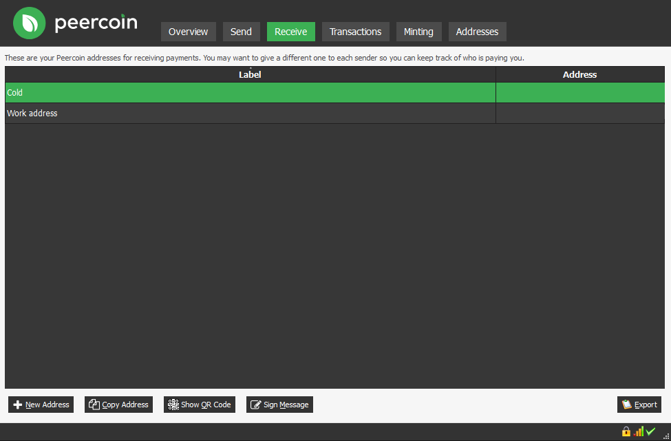
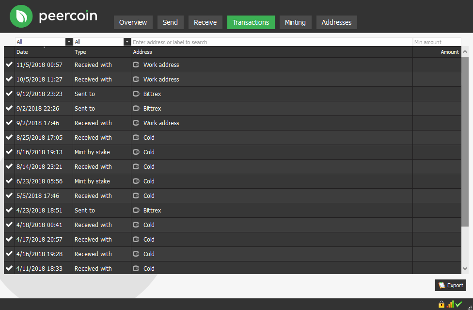
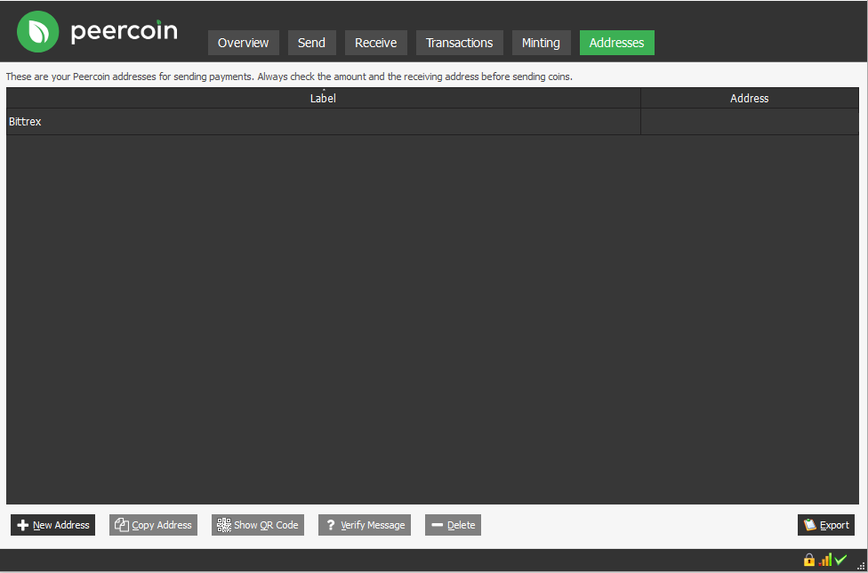
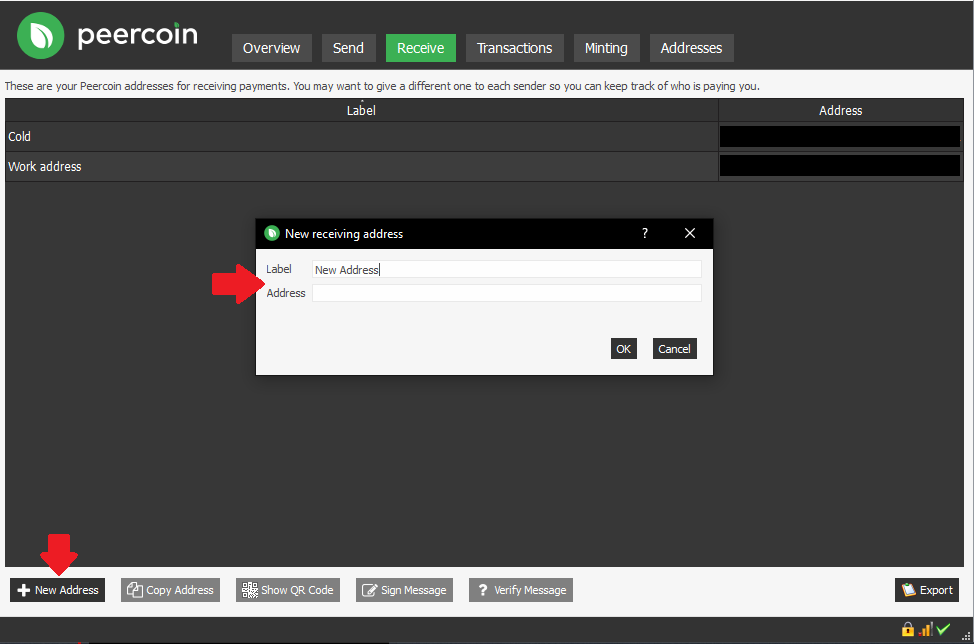
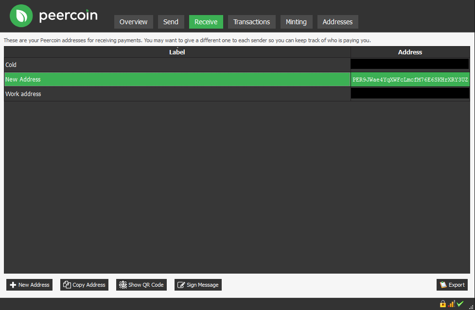
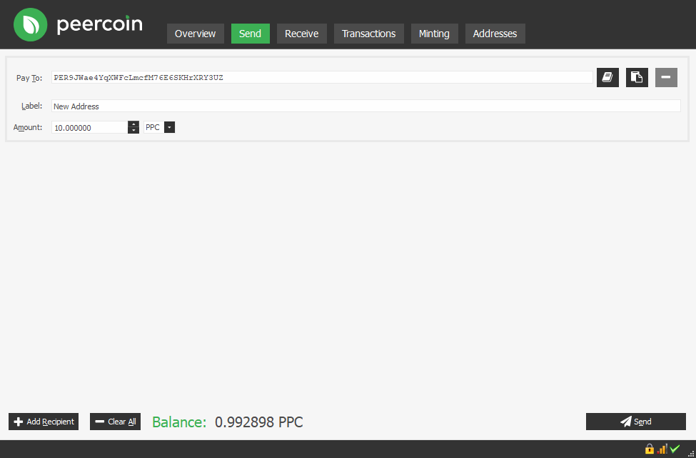

# Peercoin Core Wallet

## Overview

### Windows Installation

To install on Windows, you can find the download files here: https://peercoin.net/download.  Once download is complete, extract the contents of the folder.  Depending on if your system is x32 or x64 bits, choosing the relevant folder.  Run the peercoin-win_setup.exe and you will be guided through the installation process.  Once finishes, the client can be launched by running "peercoin-qt.exe" from the appropriate folder.

### Debian Installation

As of April 2018, Peercoin has official Debian repository hosted at `repo.peercoin.net`.
Repository is serving .deb packages for latest Debian stable, for amd64 and armhf hardware architectures.
Repository offers two packages, `peercoin-qt` which is official graphical client for the Peercoin network and `peercoind` which is a daemon client for the network.
In the future repository may host other Peercoin-related packages.

### Mac Installation

To install for MacOS, you can find the download files here: https://peercoin.net/download.  Once the download is complete, extract the contents of the folder.  Inside the extracted folder, double click the "Peercoin-Qt.dmg" file to open the client.

#### Adding the GPG key

`wget -O - https://repo.peercoin.net/peercoin.gpg.key | sudo apt-key add -`

#### Adding the repository in the sources

`sudo sh -c "echo 'deb http://repo.peercoin.net stretch main' >> /etc/apt/sources.list.d/peercoin.list"`

`sudo apt update`

#### Installing the packages

`sudo apt install peercoin-qt`

### Debian/Ubuntu Package Compilation Guide

If you want a more in-depth guide on the compilation of the client for a variety of systems, [more can be found here](004-compiling-packages-for-debian.md)
____________

## General Notes

### Wallet Encryption

When a wallet is first generated, it will be unencrypted.  In order to encryt the wallet, one must go to Settings > Encrypt Wallet.  The client will then prompt the user for a password which will then be used to verify transactions and unlock the wallet for minting in the future.  It is important to make sure this password is remembered as losing access means losing access to any coins held in that wallet.  A wallet must be encrypted in order to participate in minting.

### Backups

It is strongly recommended that a backup of the wallet.dat is made and kept in a separate location in the event of hardware failure or similar disaster.  Choosing File > Backup Wallet, will present the user with the option of where to export this file.

____________

## Wallet Overview

From this tab you can see the "Available", "Pending", and "Total" balance of your Peercoin wallet.  On the right side, you can see your "Recent transactions" as well which will show the most recent transactions that have come into the wallet recently.  

### Send

The send tab is used to send Peercoin.  The "Pay To" section is where a target address can be entered.  If you wish to label the address for future use, such as an exchange, you may add it to your address book.  Amount determines the quantity of Peercoin which will be sent in the transaction.  If the wallet is encrypted, the secure password must be entered before the send transaction can be finalized.

### Receive

The Receive tab lists all wallet addresses attached to the Peercoin client.  Generating a new address is as simple as clicking the "New Address" button at the bottom of the screen.  The "Sign Message" button can also be used to verify ownership of a wallet.  [There is a tutorial on signing messages with the Peercoin client here.](014-SigningMessages.md)  The example addresses have been removed from the image for privacy sake.

### Transactions

The Transactions tab gives a full history of recent transactions that have come in and out of the wallet since its creation.  It will list the Date, Type, Address, and Amount.  This information can be exported as a .csv using the "Export" button on the bottom right of the screen.  The amounts have been removed from the image for privacy sake.

### Minting

The Minting tab is the fifth option and from here, you can see the coin age of your transaction.  The Address, Age, Balance, CoinDay, and MintProbability, are also displayed.  Until the transaction reaches 30 days of age, it will be displayed in red, with a CoinDay of 0.  In the picture above, you can see a transaction that is red and is not eligible for staking due to it only having a an Age of 49.  In the next 30 days, it has a probability of minting of roughly 54.94%.  In 4 days, that transaction will become eligible for minting and change to green color.  You can use the "Display minting probability within:" drop-down menu to estimate the probability of minting during the next period.  Once the 30 day period has passed, and the transaction has become eligible for minting, go to Settings > Decrypt Wallet for Minting Only, and enter your wallet password.  If you have not already encrypted your wallet, you will be asked to do so.  Once the wallet has been unlocked for minting, leaving it running will allow for minting to occur.  Making a transaction from that wallet will disrupt the coin age and the maturation process will have to be repeated.  Sending more coins will not disrupt the coin age.

If you are interested in calculating the rough time until minting takes place, you can use this calculator: http://poscalculator.peercointalk.org/

Once minting occurs, the initial batch of coins will have their coin age reset, and the coins earned from minting will remain locked for 520 blocks, or roughly 3 days.  After this period, the coins will be available in the wallet.  As a note, you do not need to leave your wallet running 24/7, as the time spent staking does not increase the probability of minting taking place, as the highest coin age will always take precedence.  Holding longer also does not increase the minting reward.  

[You can read more about proof-of-stake here](010-proof-of-stake.md)

### Addresses

Addresses is the final tab and displays the addresses saved to the Address Book from the Send tab.  This is handy for managing repeat use addresses such as exchanges.  The example address has been removed from the image for privacy sake.

____________

## Creating a New Address

Creating a new address is very simple.  Navigate to the "Receive" tab and select the "New Address" button.  A window with a "Label" and "Address" field will appear.  Enter the name you want in the "Label" field.  You will be able to change this later.  Leave the "Address" field blank.  Click "Ok" to continue.  If you have already encrypted your wallet, you will need to enter your wallet password.

You can see the new address now available.  If you want to change the name of the label of the address, double click the name and you will be able to enter a new one.

_________________________________________

## Sending Peercoin

If you want to send Peercoin, navigate to the "Send" tab.  We are going to send some Peercoins to the address we created above.  This page has three fields: "Pay To", "Label", and "Amount".  Paste the address you want to send Peercoins to into the "Pay To" field.  Make sure to verify that this address is correct.  If you already have a label for this wallet, it will automatically fill in the "Label" field.  If not, you can write your own in and it will be saved in your address book (Under the "Address" tab).  In the amount field, insert the number of Peercoins you would like to send.  There is a drop down menu which allows you to determine if you want to send in denominations of "Peercoins", "MilliPeercoins", "MicroPeercoins".  Make sure that you have enough to pay for the transaction fee.  When everything is finalized, press the "Send" button to confirm the transaction.  You will be prompted to confirm the transaction and must enter your wallet password to verify the transaction.  Once this is completed, you can view the transaction under the "Transactions" tab.

_________________________________________

## Using the multisig

You can access multisig graphic interface in latest builds of Peercoin-qt. Open Peercoin-qt, click on File - Multisig. Now you see Multisig interface.

### How to create a multisig address using QT wallet

In this example, we'll go over creating 2/3 multisig address.
On your screen you see two tables, each containing "Public key", "Address" and "Label".

1) First click "+ Add public key" button, this will make three input fields. Then enter number 2 in the "Required signatures" field.

2) In the first table, we will first make input in "Address field". You can click book-like icon on the right side to load address from your address book. When you do so, other fields will be auto-populated.

3) Your partners will need to do the same and copy their entries to you. When you exchange information properly make final check to reduce chance of error and finally click on "Create multisig address" button.

4) Now multisig address is created, confirm that all of you got the same address.

5) Finally click "Add address to wallet" in lower right to have it listed in your address book.

That is it, now you have your 2/3 multisig address.

#### Creating a multisig address using the command line interface (debug console)

The multisig address is generated with the complete public keys of the participants.

**Alice:**

validateaddress "mw2pj33HMhRfRkKtceHcyKpPiGYkPdD4SM"

    {
      "isvalid" : true,
      "address" : "mw2pj33HMhRfRkKtceHcyKpPiGYkPdD4SM",
      "ismine" : true,
      "isscript" : false,
      "pubkey" : "02c16ff447129fae7374d97212cf9fcd88a744da87ff2985869065cd6d17ee5c0b",
      "iscompressed" : true,
      "account" : "Alice"
    }

**Bob:**

validateaddress "mkLNecFNeiJgKjw6492nqDiQfKQs1JnLmE"

     {
       "isvalid" : true,
       "address" : "mkLNecFNeiJgKjw6492nqDiQfKQs1JnLmE",
       "ismine" : true,
       "pubkey" : "025cc4b319284aabcdaef6e9a18af0bb73ac5d4b9f2556a214f30686b0173b316e",
       "iscompressed" : true,
       "account" : "Bob"
     }

**Charlie:**

validateaddress "mm8Fwn92RU8zvJmH7TCpaYL3v4PTyjN4xd"

    {
      "isvalid" : true,
      "address" : "mm8Fwn92RU8zvJmH7TCpaYL3v4PTyjN4xd",
      "ismine" : true,
      "isscript" : false,
      "pubkey" : "033ba42c942ff7e7fcf42ff604d6ef6c51826f9eea3a04308379c2ade98fb9e703",
      "iscompressed" : true,
      "account" : "Trent"
    }

createmultisig 2 '["02c16ff447129fae7374d97212cf9fcd88a744da87ff2985869065cd6d17ee5c0b", "025cc4b319284aabcdaef6e9a18af0bb73ac5d4b9f2556a214f30686b0173b316e", "033ba42c942ff7e7fcf42ff604d6ef6c51826f9eea3a04308379c2ade98fb9e703"]'

    {
      "address" : "2N582fRZZZm9hL4RH4sguG9SDDLZhu7eeng",
      "redeemScript" : "522102c16ff447129fae7374d97212cf9fcd88a744da87ff2985869065cd6d17ee5c0b21025cc4b319284aabcdaef6e9a18af0bb73ac5d4b9f2556a214f30686b0173b316e21033ba42c942ff7e7fcf42ff604d6ef6c51826f9eea3a04308379c2ade98fb9e70353ae"
    }

_________________________________________

### How to spend from the multisig address

Reference Peercoin client is not capable of indexing the multisig addresses and showing their balance because multisig addresses can be owned by keys which are not part of the wallet (friends, family, backup). Thus the procedure to spend the funds from the multisig is a bit more complicated, more "low level" then usual.

In the "Spend Funds" tab of the multisig dialog, on the left there is "Inputs" table. You need to provide with the [UTXO](https://en.wikipedia.org/wiki/Unspent_transaction_output) you want to spend. That is, the `txid` and output index. On the right side there is "Outputs" table, where the desired outputs will be placed. Please note that you have to include the change output and deduct the tx fee (0.01 PPC per kB).

After that is set, click on the "Create Transaction" button bellow, and copy the resulting hash to your peers for further signing.
Finally paste the hash of fully signed raw transaction into "Sign Transaction" box bellow and click send.

#### Spending from the multisig via command line interface

Bob creates a transaction to spend the coins that Alice sent to the multisig address.
The transaction will have 360 PPC (Alice's coins) as input and 359.99 PPC as output (because of the mandatory 0.01 PPC transaction fee; the transaction won't be accepted by the network without it).

**Bob:**

getrawtransaction "0ef16552d0dadaa150da34cfbc5380e82d59b5f328f967fb72104c43a1b99f74" 1

    {
      "hex" : "01000000197f5a530105a302fe97c3ab33581486fdb39296e8728d2dac7b06324a62ab83515c30d9d8000000006b4830450221008054ee73403f401b2c10acdaed1e51e5345d35fb24574719d8a01203934c6e3202204d97e79ccdae05713b18d85e36896e3bd7a1a0636bd207a493779ca6a7c148c4012102c16ff447129fae7374d97212cf9fcd88a744da87ff2985869065cd6d17ee5c0bffffffff02f0591b2c000000001976a9149f99f0ec7288694065243d32bea766bf9a8d602188ac002a75150000000017a914824524d69e3c8f2ea66e39af89727bc0e8d3de4b8700000000",
      "txid" : "0ef16552d0dadaa150da34cfbc5380e82d59b5f328f967fb72104c43a1b99f74",
      "version" : 1,
      "locktime" : 0,
      "vin" : [
        {
          "txid" : "d8d9305c5183ab624a32067bac2d8d72e89692b3fd86145833abc397fe02a305",
          "vout" : 0,
          "scriptSig" : {
            "asm" : "30450221008054ee73403f401b2c10acdaed1e51e5345d35fb24574719d8a01203934c6e3202204d97e79ccdae05713b18d85e36896e3bd7a1a0636bd207a493779ca6a7c148c401 02c16ff447129fae7374d97212cf9fcd88a744da87ff2985869065cd6d17ee5c0b",
            "hex" : "4830450221008054ee73403f401b2c10acdaed1e51e5345d35fb24574719d8a01203934c6e3202204d97e79ccdae05713b18d85e36896e3bd7a1a0636bd207a493779ca6a7c148c4012102c16ff447129fae7374d97212cf9fcd88a744da87ff2985869065cd6d17ee5c0b"
          },
          "sequence" : 4294967295
        }
      ],
      "vout" : [
        {
          "value" : 739.99000000,
          "n" : 0,
          "scriptPubKey" : {
            "asm" : "OP_DUP OP_HASH160 9f99f0ec7288694065243d32bea766bf9a8d6021 OP_EQUALVERIFY OP_CHECKSIG",
            "hex" : "76a9149f99f0ec7288694065243d32bea766bf9a8d602188ac",
            "reqSigs" : 1,
            "type" : "pubkeyhash",
            "addresses" : [
              "mv4r9a4FXuDgSA5GaFtLGC9W5Db3XJUrLD"
            ]
          }
        },
        {
          "value" : 360.00000000,
          "n" : 1,
          "scriptPubKey" : {
            "asm" : "OP_HASH160 824524d69e3c8f2ea66e39af89727bc0e8d3de4b OP_EQUAL",
            "hex" : "a914824524d69e3c8f2ea66e39af89727bc0e8d3de4b87",
            "reqSigs" : 1,
            "type" : "scripthash",
            "addresses" : [
              "2N582fRZZZm9hL4RH4sguG9SDDLZhu7eeng"
            ]
          }
        }
      ],
      "blockhash" : "05a7088c02f589ca91beb52ea9667955f7ee10a2433e56f2e11a058c2273bb70",
      "confirmations" : 2,
      "time" : 1398439709,
      "blocktime" : 1398439709
    }

createrawtransaction '[{"txid" : "0ef16552d0dadaa150da34cfbc5380e82d59b5f328f967fb72104c43a1b99f74", "vout" : 1, "scriptPubKey" : "a914824524d69e3c8f2ea66e39af89727bc0e8d3de4b87", "redeemScript" : "522102c16ff447129fae7374d97212cf9fcd88a744da87ff2985869065cd6d17ee5c0b21025cc4b319284aabcdaef6e9a18af0bb73ac5d4b9f2556a214f30686b0173b316e21033ba42c942ff7e7fcf42ff604d6ef6c51826f9eea3a04308379c2ade98fb9e70353ae"}]' '{"mub5ke5cWP4nZW2VDgtAkFGA7UzSVhwese" : 359.99}'

    0100000062815a5301749fb9a1434c1072fb67f928f3b5592de88053bccf34da50a1dadad05265f10e0100000000ffffffff01f0027515000000001976a9149a59a69866c7668acdd2b36491cfc18229d2348988ac00000000

##### First signature of the transaction

Bob signs the new transaction with the private key associated to the public key he used to create the multisig address and sends the result to Alice.

**Bob:**

dumpprivkey "mkLNecFNeiJgKjw6492nqDiQfKQs1JnLmE"

    cTxxxxxxxxxxxxxxxxxxxxxxxxxxxxxxxxxxxxxxxxxxxxxxxxo5

signrawtransaction "0100000062815a5301749fb9a1434c1072fb67f928f3b5592de88053bccf34da50a1dadad05265f10e0100000000ffffffff01f0027515000000001976a9149a59a69866c7668acdd2b36491cfc18229d2348988ac00000000" '[{"txid" : "0ef16552d0dadaa150da34cfbc5380e82d59b5f328f967fb72104c43a1b99f74", "vout" : 1, "scriptPubKey" : "a914824524d69e3c8f2ea66e39af89727bc0e8d3de4b87", "redeemScript" : "522102c16ff447129fae7374d97212cf9fcd88a744da87ff2985869065cd6d17ee5c0b21025cc4b319284aabcdaef6e9a18af0bb73ac5d4b9f2556a214f30686b0173b316e21033ba42c942ff7e7fcf42ff604d6ef6c51826f9eea3a04308379c2ade98fb9e70353ae"}]' '["cTxxxxxxxxxxxxxxxxxxxxxxxxxxxxxxxxxxxxxxxxxxxxxxxxo5"]'

    {
      "hex" : "0100000062815a5301749fb9a1434c1072fb67f928f3b5592de88053bccf34da50a1dadad05265f10e01000000b40047304402201dfd957507d6b48b777a6f5c31d85fb8d00513b79c55dbd902c7f6dee90bc4cc0220773f05b481a9dbbc3153cb832acd994caef0d569de49d3b4a125b5f1e637836c014c69522102c16ff447129fae7374d97212cf9fcd88a744da87ff2985869065cd6d17ee5c0b21025cc4b319284aabcdaef6e9a18af0bb73ac5d4b9f2556a214f30686b0173b316e21033ba42c942ff7e7fcf42ff604d6ef6c51826f9eea3a04308379c2ade98fb9e70353aeffffffff01f0027515000000001976a9149a59a69866c7668acdd2b36491cfc18229d2348988ac00000000",
      "complete" : false
    }

##### Second signature of the transaction

Let's imagine that Alice refuses to sign the transaction.
Bob sends the transaction with one signature to Trent and asks him to validate it. Let's imagine that Trent decides that the transaction is legitimate.
Trent signs the transaction with the private key associated to the public key he used to create the multisig address.

**Charlie:**

dumpprivkey "mm8Fwn92RU8zvJmH7TCpaYL3v4PTyjN4xd"

    cPxxxxxxxxxxxxxxxxxxxxxxxxxxxxxxxxxxxxxxxxxxxxxxxxis

signrawtransaction "0100000062815a5301749fb9a1434c1072fb67f928f3b5592de88053bccf34da50a1dadad05265f10e01000000b40047304402201dfd957507d6b48b777a6f5c31d85fb8d00513b79c55dbd902c7f6dee90bc4cc0220773f05b481a9dbbc3153cb832acd994caef0d569de49d3b4a125b5f1e637836c014c69522102c16ff447129fae7374d97212cf9fcd88a744da87ff2985869065cd6d17ee5c0b21025cc4b319284aabcdaef6e9a18af0bb73ac5d4b9f2556a214f30686b0173b316e21033ba42c942ff7e7fcf42ff604d6ef6c51826f9eea3a04308379c2ade98fb9e70353aeffffffff01f0027515000000001976a9149a59a69866c7668acdd2b36491cfc18229d2348988ac00000000" '[{"txid" : "0ef16552d0dadaa150da34cfbc5380e82d59b5f328f967fb72104c43a1b99f74", "vout" : 1, "scriptPubKey" : "a914824524d69e3c8f2ea66e39af89727bc0e8d3de4b87", "redeemScript" : "522102c16ff447129fae7374d97212cf9fcd88a744da87ff2985869065cd6d17ee5c0b21025cc4b319284aabcdaef6e9a18af0bb73ac5d4b9f2556a214f30686b0173b316e21033ba42c942ff7e7fcf42ff604d6ef6c51826f9eea3a04308379c2ade98fb9e70353ae"}]' '["cPxxxxxxxxxxxxxxxxxxxxxxxxxxxxxxxxxxxxxxxxxxxxxxxxis"]'

    {
      "hex" : "0100000062815a5301749fb9a1434c1072fb67f928f3b5592de88053bccf34da50a1dadad05265f10e01000000fdfd000047304402201dfd957507d6b48b777a6f5c31d85fb8d00513b79c55dbd902c7f6dee90bc4cc0220773f05b481a9dbbc3153cb832acd994caef0d569de49d3b4a125b5f1e637836c014830450220576a38baba9c821a5dbfce6be50825322995041a052f8a76016928ee2741b542022100e95dcefd049628e8c422ee584eb1c3feab3d00f7111a29a16f40353ff7de9648014c69522102c16ff447129fae7374d97212cf9fcd88a744da87ff2985869065cd6d17ee5c0b21025cc4b319284aabcdaef6e9a18af0bb73ac5d4b9f2556a214f30686b0173b316e21033ba42c942ff7e7fcf42ff604d6ef6c51826f9eea3a04308379c2ade98fb9e70353aeffffffff01f0027515000000001976a9149a59a69866c7668acdd2b36491cfc18229d2348988ac00000000",
      "complete" : true
    }

##### Send the signed transaction to the network

The transaction has the two required signatures, anyone can send it to the network.

sendrawtransaction "0100000062815a5301749fb9a1434c1072fb67f928f3b5592de88053bccf34da50a1dadad05265f10e01000000fdfd000047304402201dfd957507d6b48b777a6f5c31d85fb8d00513b79c55dbd902c7f6dee90bc4cc0220773f05b481a9dbbc3153cb832acd994caef0d569de49d3b4a125b5f1e637836c014830450220576a38baba9c821a5dbfce6be50825322995041a052f8a76016928ee2741b542022100e95dcefd049628e8c422ee584eb1c3feab3d00f7111a29a16f40353ff7de9648014c69522102c16ff447129fae7374d97212cf9fcd88a744da87ff2985869065cd6d17ee5c0b21025cc4b319284aabcdaef6e9a18af0bb73ac5d4b9f2556a214f30686b0173b316e21033ba42c942ff7e7fcf42ff604d6ef6c51826f9eea3a04308379c2ade98fb9e70353aeffffffff01f0027515000000001976a9149a59a69866c7668acdd2b36491cfc18229d2348988ac00000000"

    fea9875ccac102897ff128c868027a05e3d2f9057569529c8e5e94f8d641bc47

_________________________________________
