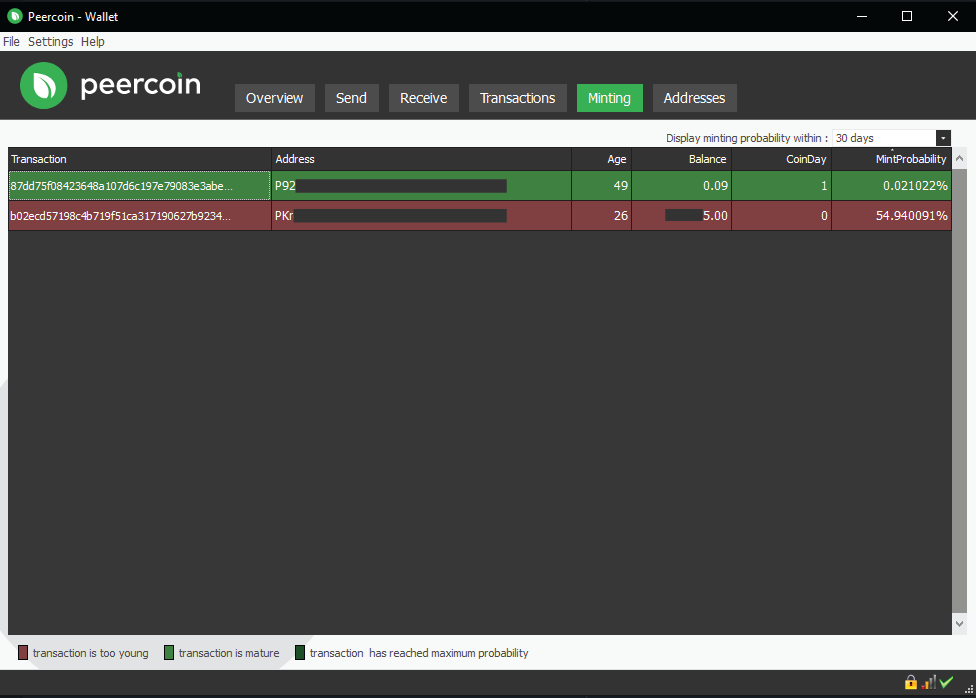

# Minting

The Minting tab is the fifth option and from here, you can see the coin age of your transaction.  The Address, Age, Balance, CoinDay, and MintProbability, are also displayed.  Until the transaction reaches 30 days of age, it will be displayed in red, with a CoinDay of 0.  In the picture above, you can see a transaction that is red and is not eligible for staking due to it only having a an Age of 49.  In the next 30 days, it has a probability of minting of roughly 54.94%.  In 4 days, that transaction will become eligible for minting and change to green color.  You can use the "Display minting probability within:" drop-down menu to estimate the probability of minting during the next period.  Once the 30 day period has passed, and the transaction has become eligible for minting, go to Settings > Decrypt Wallet for Minting Only, and enter your wallet password.  If you have not already encrypted your wallet, you will be asked to do so.  Once the wallet has been unlocked for minting, leaving it running will allow for minting to occur.  Making a transaction from that wallet will disrupt the coin age and the maturation process will have to be repeated.  Sending more coins will not disrupt the coin age.

If you are interested in calculating the rough time until minting takes place, you can use this calculator: http://poscalculator.peercointalk.org/

Once minting occurs, the initial batch of coins will have their coin age reset, and the coins earned from minting will remain locked for 520 blocks, or roughly 3 days.  After this period, the coins will be available in the wallet.  As a note, you do not need to leave your wallet running 24/7, as the time spent staking does not increase the probability of minting taking place, as the highest coin age will always take precedence.  Holding longer also does not increase the minting reward.
